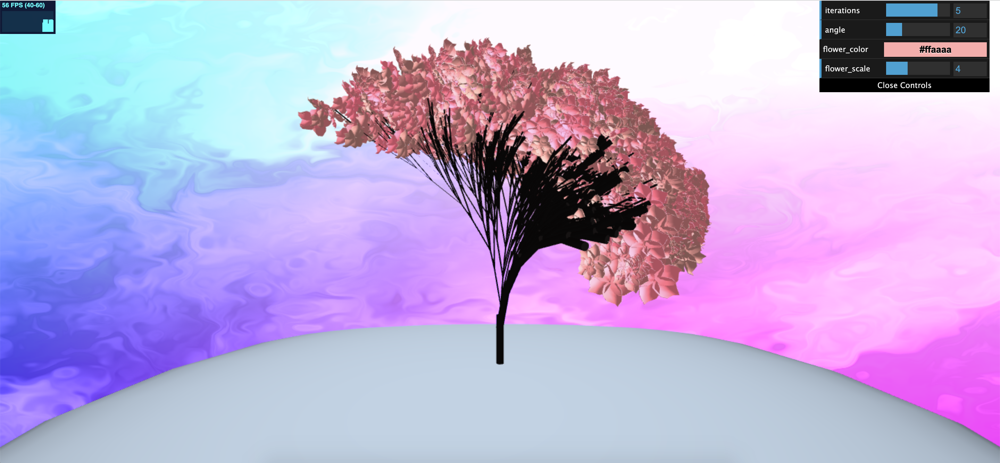
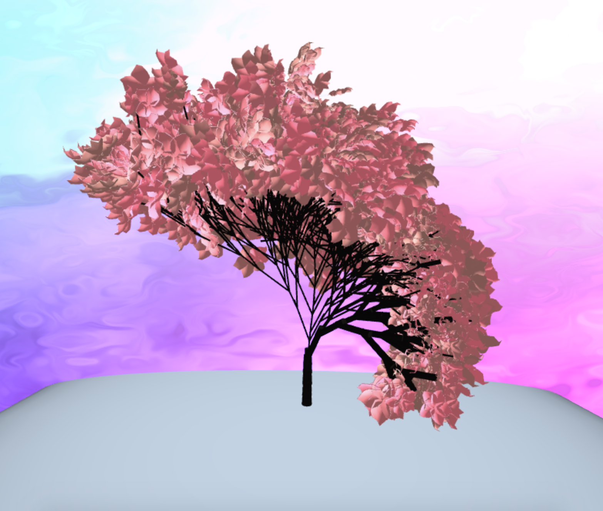
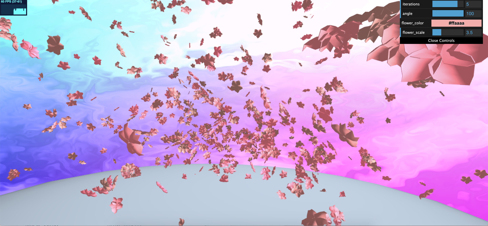
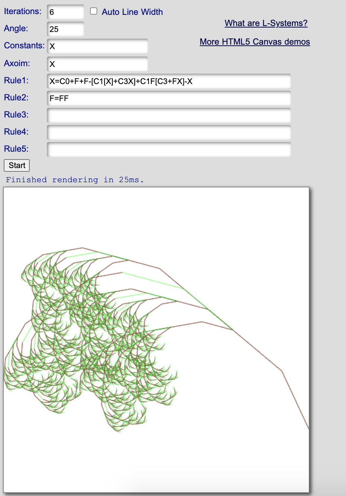
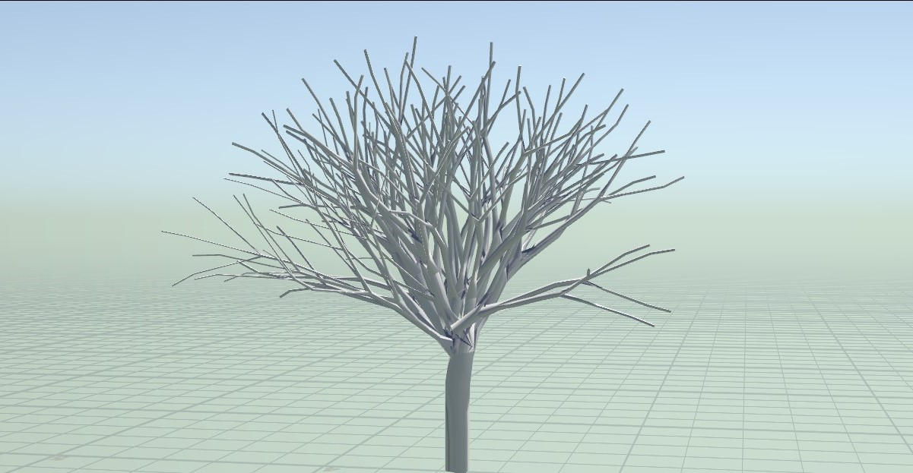
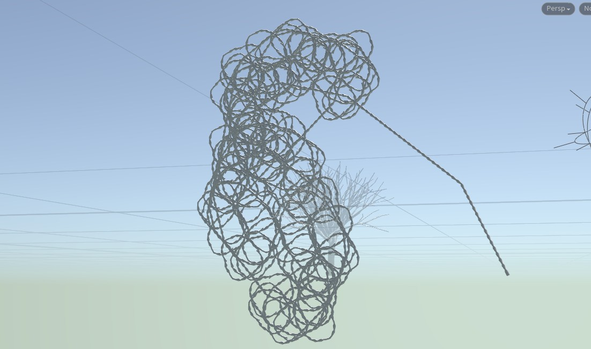

# CIS 566 Homework 4: L-systems

## Objective

- Design a set of formal grammar rules to create a plant life using an L-system program
- Implement your own set of classes to handle the L-system grammar expansion and drawing
- Rasterized L-system using faceted geometry

## Techniques

 

Tree "explodes" when angle > 35 

Collection of classes to represent an L-system

- created `Turtle, ExpansionRule, DrawingRule`, and `LSystem` class inside the lsystem folder

Instanced rendering

- Set up the code in `main.ts` and `ShaderProgram.ts` to pass a collection of transformation data to the GPU to draw L-System geometric components
- Created `setInstanceVBOTransform` function inside mesh class to pass transform data for instance rendering

Lsystem scene progress:

lsystem experimentation with turtle renderer: 

- using https://kevs3d.co.uk/dev/lsystems/ to experiment with the lsystem grammar

houdini tree:  

- experimenting with houdini

## General Information

Name: Amelia Peng

PennKey: pqy

Live Demo: https://ameliapqy.github.io/hw04-l-systems/

Resources:

- https://kevs3d.co.uk/dev/lsystems/
- https://www.sidefx.com/docs/houdini/nodes/sop/lsystem.html
