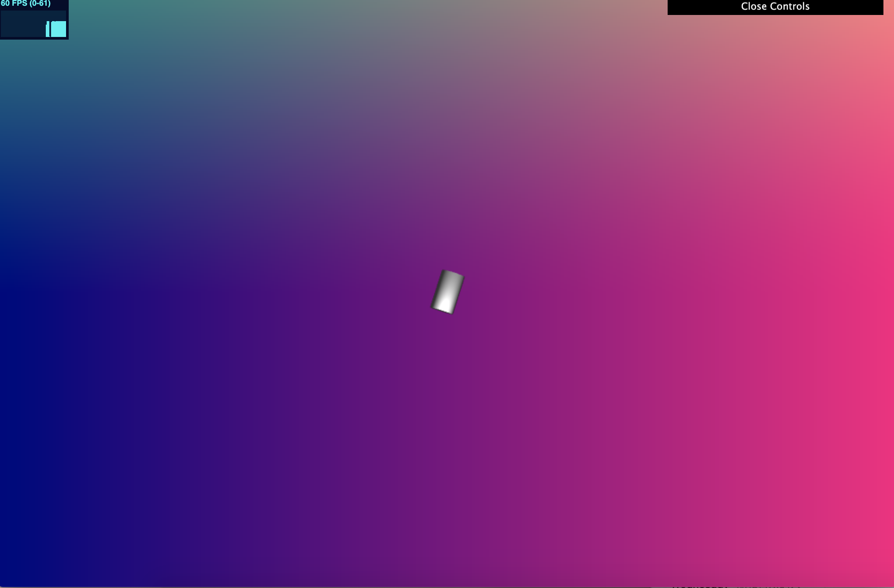

# CIS 566 Homework 4: L-systems

## Objective

- Gain experience with signed distance functions
- Experiment with animation curves

## Techniques

lsystem: 

- using https://kevs3d.co.uk/dev/lsystems/ to experiment with the lsystem grammar

houdini tree: 

- experimenting with houdini

progress1: 
- cylinder shows up

progress2: 
- coded a background with fbm noise

## General Information

Name: Amelia Peng

PennKey: pqy

Live Demo (WIP): https://ameliapqy.github.io/hw04-l-systems/

Resources:

- https://kevs3d.co.uk/dev/lsystems/
- https://www.sidefx.com/docs/houdini/nodes/sop/lsystem.html
